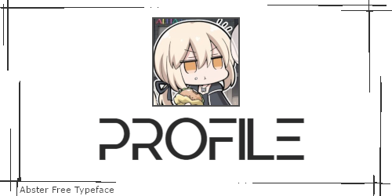

----

**About me**

- 业余菜鸟
- 二刺螈LSP
- 偶尔可能写一点没用的玩意儿
- 咕咕咕
- 持续~~学习~~摸鱼中
- 遇到困难睡大觉

​    

<ruby>喜多<rt>きた</rt></ruby> <ruby>喜多<rt>きた</rt></ruby>

有这回事？

<ruby>郁代<rt>いくよ</rt></ruby> <ruby>郁代<rt>いくよ</rt></ruby>

> [!WARNING]\
>
> WARNING

> [!NOTE]\
>
> NOTE